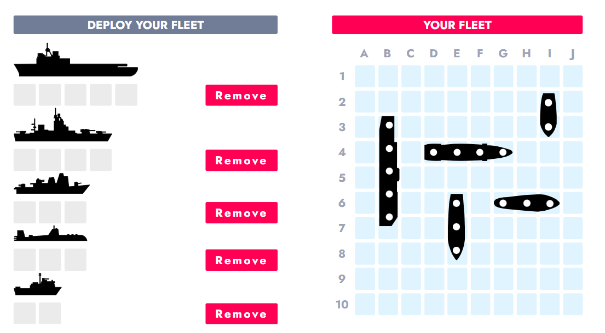

# battleship游戏介绍
battleship是构建于零知识证明（groth16）体系之上的一个战舰游戏,对战双方在不知晓对方战舰摆放位置的情况下，每轮选择棋盘上的一个点进行射击，若击中对方战舰（该点坐标与对方的战舰所占的点的坐标重合），则计一分,分数达到设置的目标（最大击中次数）时，获得游戏胜利。

游戏双方通过battleship合约进行交互，由于需要隐藏部分重要信息（双方战舰的摆放位置）,并约束双方遵循游戏规则，因此引入了groth16零知识证明系统。

## 棋盘与战舰坐标

如上图所示，每个玩家需要摆放五艘战舰,战舰只能在开始游戏或加入游戏时摆放，一旦确定，后续无法改变战舰位置。五艘战舰的长度分别为5、4、3、3、2个单元格，战舰的坐标由x、y、z三个分量构成，其中(x,y)可以对应棋盘上的某个点，而z取值0或1，0表示战舰横向摆放，1表示战舰纵向摆放。给定战舰的坐标和长度，则可以计算战舰在棋盘中占据了哪些单元格。

## 电路
在此游戏中，存在以下两个ZKP电路: board.circom和shot.circom。

### board.circom
此电路接收五艘战舰的坐标（ships:5*3数组,private）以及ships的hash(public)作为输入，验证战舰摆放符合游戏规则，具体检查如下:
1. 检查战舰的位置范围(占据的单元格是否均未超过棋盘的范围)；
2. 检查战舰是否碰撞，5艘战舰摆放不可以有重叠的单元格；
3. 检查输入的hash值和ships是否对应，即Hash(ships)?=hash。

### shot.circom
此电路接收ships(同上,private)、hash(同上,public)、shot(射击的点[x,y],public)和hit(取值1和0，是否击中战舰,public)作为输入，验证是否击中战舰，具体的检查规则如下:
1. 检查shot是否落在棋盘范围内；
2. 检查输入的hash值和ships是否对应，即Hash(ships)?=hash；
3. 检查shot的坐标是否被包含在ships所占据的单元格中，然后根据检查结果，判断hit断言是否正确

## 合约
battleship game包含一个主合约和两个验证合约：`battleship.move`、`board_verifier.move`、`shot_verifier.move`

### groth16 in move
sui move的标准库提供了groth16的验证算法：见[groth16.move](https://github.com/MystenLabs/sui/blob/main/crates/sui-framework/packages/sui-framework/sources/crypto/groth16.move),因此可以将验证合约视为groth16协议中的验证者，即可调用验证合约来验证证明的有效性。

在部署合约之前，需要编译电路，并执行groth16协议的setup以生成proving key和verification key,可以借助以下工具:

* [circom](https://github.com/iden3/circom)
* [snarkjs](https://github.com/iden3/snarkjs)

生成verification key后，需要将`board_verifier.move`和`shot_verifier.move`中的`VK_BYTES`、`ALPHA_BYTES`、`GAMMA_BYTES`、`DELTA_BYTES`替换成verification key中的对应参数（需要序列化其中的参数，转成hex string类型）,此时`board_verifier.move`和`shot_verifier.move`才可充当一个“验证者”。值得注意的是，groth16的一个key只能对应一个电路，因此`board_verifier`和`shot_verifier`应是不同的verification key。参数的序列化参考[battleship test on sui blockchain](https://github.com/YuexingZeng/sui-test)

`board_verifier.move`和`shot_verifier.move`通过调用groth16.move中的`verify_groth16_proof`函数验证相应的证明。

### battleship.move
此合约定义了battleship game的主要逻辑和规则。其中包含new_game、join_game、first_turn和turn这四个函数,下面主要说明这四个函数中是如何进行proof verify的,交互双方以Alice和Bob为例:

* new_game: Alice创建游戏,在调用此函数之前，需要为其摆放的ships生成witness和proof（可使用[snarkjs](https://github.com/iden3/snarkjs)）,new_game通过调用board_verifier合约验证其摆放的战舰位置符合规则，且不会透漏战舰的摆放位置；

* join_game: Bob加入游戏, 与new_game类似，调用board_verifier合约验证其摆放的战舰位置符合规则；

* first_turn: Alice进行第一次射击,first_turn函数不涉及proof verify；

* turn: Bob射击,此函数会调用shot_verifier验证上一次的射击（Alice的射击）是否命中己方的战舰。

后续双方轮流调用`turn`进行游戏交互。

合约中还定义了其它的交互逻辑，具体请参考[battleship.move](./sources/battleship.move)。

